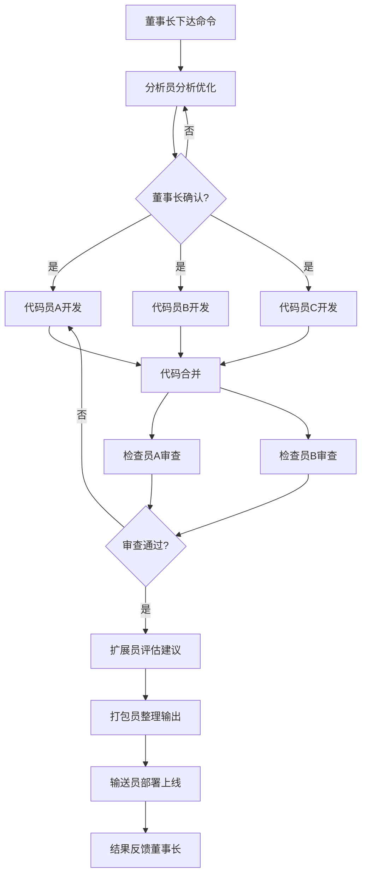

# 产品需求文档 (PRD) - 多Agent协作系统

## 1. 产品概述
HopeAI 多Agent协作系统是一个模拟企业组织架构的智能协作平台，以"董事长"为核心指挥，通过分析员、代码员、检查员、扩展员、打包员、输送员等多个智能Agent角色协同工作，实现从需求分析到代码产出再到部署上线的全自动化流程。系统采用极客风格的终端式界面，为用户提供沉浸式的Agent协作体验。

- 核心价值：将复杂的软件开发流程拆解为专业化Agent角色，模拟真实团队协作，提升创意产出与代码质量
- 目标用户：开发者、创意工作者、企业决策者
- 差异化：终端极客美学 + 多角色Agent协作 + 知识库沉淀 + 一键部署

---

## 2. 核心功能

### 2.1 用户角色
| 角色 | 描述 | 核心权限 |
|------|------|----------|
| 董事长 (用户) | 系统最高决策者，下达命令、确认方案 | 下达命令、确认分析结果、查看全流程、部署推送 |
| 分析员 | 负责分析思路、优化语言、确认需求 | 需求拆解、方案优化、向董事长确认、传递给代码员 |
| 代码员 (x3) | 负责编写代码与核心编程 | 代码实现、技术选型、协同编码、合并输出 |
| 检查员 (x2) | 检查代码错误与需求一致性 | 代码审查、Bug检测、质量评估、反馈修正 |
| 扩展员 | 提出未来发展方向与多维度思考 | 扩展性分析、技术展望、架构建议 |
| 打包员 | 将成果整理为可保存/下载/复制的文件 | 文件打包、格式转换、输出整理 |
| 输送员 | 将成果推送到指定仓库 | GitHub部署、版本管理、页面更新 |

### 2.2 功能模块
1. **主控面板**：命令输入区、Agent状态看板、流程进度条
2. **对话系统**：多角色对话流、消息气泡、角色头像标识、打字机效果
3. **知识库**：项目文档存储、历史对话检索、知识标签分类
4. **代码预览**：代码高亮展示、文件树导航、复制下载功能
5. **部署中心**：GitHub配置、仓库选择、一键推送、部署日志
6. **设置面板**：主题切换、Agent参数配置、API密钥管理

### 2.3 页面详情
| 页面名称 | 模块名称 | 功能描述 |
|----------|----------|----------|
| 主控台 | 顶部状态栏 | 系统状态、时间显示、网络状态、设置入口 |
| 主控台 | 左侧Agent面板 | 7个Agent角色卡片、在线/忙碌/空闲状态指示、当前任务显示 |
| 主控台 | 中央对话区 | 多角色消息流、命令输入框、发送按钮、快捷指令 |
| 主控台 | 右侧详情面板 | 代码预览、文件列表、知识库条目、部署状态 |
| 知识库页 | 分类导航 | 按项目/类型/时间分类的知识条目 |
| 知识库页 | 搜索区 | 全文搜索、标签筛选、高级搜索 |
| 知识库页 | 内容区 | Markdown渲染、代码高亮、关联知识推荐 |
| 部署中心 | 仓库配置 | GitHub Token配置、仓库地址设置、分支管理 |
| 部署中心 | 部署队列 | 待部署任务列表、部署进度、历史记录 |
| 设置页 | 主题设置 | 极客主题切换、字体大小、动效开关 |
| 设置页 | Agent配置 | 各Agent角色参数、响应风格、工作模式 |

---

## 3. 核心流程

### 3.1 主工作流
董事长下达命令 → 分析员接收并分析 → 向董事长确认方案 → 确认后分发至3个代码员 → 代码员并行开发 → 合并代码 → 2个检查员交叉审查 → 通过后交扩展员评估 → 扩展员提出发展建议 → 打包员整理输出 → 输送员部署上线 → 结果反馈给董事长

### 3.2 对话交互流
用户在命令行输入指令 → 系统解析意图 → 匹配对应Agent → Agent流式输出响应 → 多轮对话推进任务 → 任务成果存入知识库

---

## 4. 用户界面设计

### 4.1 设计风格
- **整体风格**：赛博朋克极客风 / 终端黑客美学
- **主色调**：深黑背景 (#0a0a0f) + 霓虹绿 (#00ff88) + 电光蓝 (#00d4ff) + 警示红 (#ff3366)
- **辅助色**：琥珀黄 (#ffaa00)、矩阵紫 (#aa00ff)
- **字体**：
  - 标题：等宽字体 + 科技感字形 (JetBrains Mono / Fira Code)
  - 正文：等宽字体，保证代码可读性
- **按钮风格**：锐利直角边框、辉光悬浮效果、扫描线动画
- **布局风格**：三栏式终端布局、可拖拽分隔线、网格化信息展示
- **图标风格**：线性简约图标 + 发光效果、ASCII艺术装饰
- **动效**：打字机输出、光标闪烁、矩阵雨背景、扫描线叠加、Glitch故障效果

### 4.2 页面设计概览
| 页面名称 | 模块名称 | UI元素 |
|----------|----------|--------|
| 主控台 | 顶部状态栏 | 等宽字体时间、系统状态指示灯、ASCII艺术Logo、扫描线动画 |
| 主控台 | Agent面板 | 角色卡片带辉光边框、状态指示灯、进度条带条纹动画、头像用字符画 |
| 主控台 | 对话区 | 终端风格消息气泡、代码块带语法高亮、角色名称彩色标识、打字机光标 |
| 主控台 | 输入区 | 命令行风格输入框、前缀提示符 `>`、快捷指令标签、发送按钮辉光 |
| 知识库 | 列表区 | 卡片式知识条目、标签色带、日期时间戳、悬浮辉光效果 |
| 部署中心 | 状态区 | 终端风格日志输出、进度条带百分比、部署状态图标 |
| 设置页 | 配置区 | 开关组件带滑动动画、滑块带刻度、输入框带下划线焦点效果 |

### 4.3 响应式
- 桌面端（1440px+）：三栏完整布局，所有面板同时展示
- 平板端（1024px）：两栏布局，右侧面板可折叠
- 移动端（768px以下）：单栏堆叠，底部Tab导航切换面板

### 4.4 视觉细节
- 背景：深黑底色 + 细微网格纹理 + 微弱矩阵雨粒子动画
- 边框：1px 霓虹色发光边框，hover时增强辉光
- 滚动条：自定义细滚动条，霓虹色滑块
- 选中效果：反色选中 + 辉光
- 加载状态：终端风格进度条、跳动的ASCII字符loading
