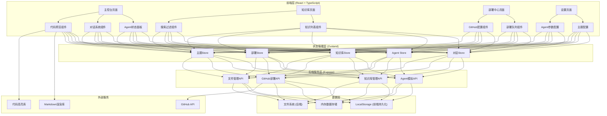
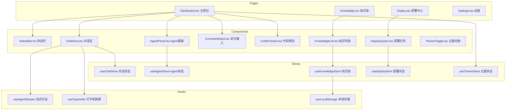
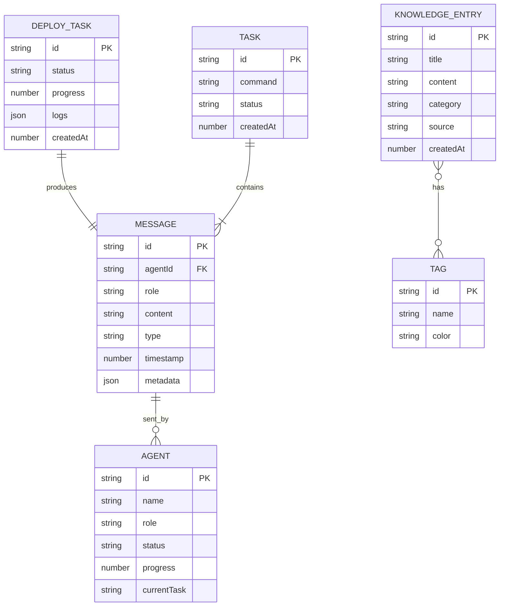

# 技术架构文档 - 多Agent协作系统

## 1. 架构设计



## 2. 技术描述

- **前端框架**: React 18 + TypeScript
- **构建工具**: Vite 5
- **样式方案**: TailwindCSS 3 + CSS变量主题系统
- **状态管理**: Zustand
- **路由管理**: React Router DOM 6
- **后端框架**: Express 4 + TypeScript
- **图标库**: Lucide React
- **Markdown渲染**: react-markdown + remark-gfm
- **代码高亮**: prismjs / react-syntax-highlighter
- **动画效果**: CSS动画 + Framer Motion (轻量使用)
- **HTTP客户端**: fetch API (原生)
- **部署目标**: GitHub Pages

## 3. 路由定义

| 路由 | 页面 | 用途 |
|------|------|------|
| `/` | 主控台 | 主要工作区，Agent协作对话 |
| `/knowledge` | 知识库 | 知识条目浏览与管理 |
| `/deploy` | 部署中心 | GitHub部署配置与执行 |
| `/settings` | 设置 | 主题、Agent参数配置 |

## 4. API 定义

### 4.1 Agent 对话 API

```typescript
// 消息类型
interface Message {
  id: string;
  role: 'chairman' | 'analyst' | 'coder1' | 'coder2' | 'coder3' | 'inspector1' | 'inspector2' | 'expander' | 'packager' | 'delivery';
  content: string;
  timestamp: number;
  type: 'text' | 'code' | 'file' | 'status';
  metadata?: Record<string, any>;
}

// Agent 状态
interface AgentState {
  id: string;
  name: string;
  role: string;
  status: 'idle' | 'thinking' | 'working' | 'done' | 'error';
  currentTask?: string;
  progress: number;
  lastActive: number;
}

// POST /api/agent/command
// 下达命令，启动Agent工作流
interface CommandRequest {
  command: string;
  context?: string[];
}
interface CommandResponse {
  taskId: string;
  status: 'started';
}

// GET /api/agent/stream/:taskId (SSE)
// 流式获取Agent输出
interface StreamEvent {
  type: 'message' | 'status' | 'progress' | 'complete';
  agentId: string;
  data: any;
}
```

### 4.2 知识库 API

```typescript
interface KnowledgeEntry {
  id: string;
  title: string;
  content: string;
  tags: string[];
  category: string;
  createdAt: number;
  updatedAt: number;
  source: 'conversation' | 'manual' | 'deployment';
}

// GET /api/knowledge?category=&tag=&search=
interface KnowledgeListResponse {
  entries: KnowledgeEntry[];
  total: number;
}

// POST /api/knowledge
interface CreateKnowledgeRequest {
  title: string;
  content: string;
  tags: string[];
  category: string;
}

// DELETE /api/knowledge/:id
```

### 4.3 部署 API

```typescript
interface DeployConfig {
  githubToken: string;
  repoUrl: string;
  branch: string;
  targetPath: string;
}

interface DeployTask {
  id: string;
  status: 'pending' | 'building' | 'uploading' | 'done' | 'error';
  progress: number;
  logs: string[];
  createdAt: number;
  completedAt?: number;
}

// POST /api/deploy/run
interface DeployRequest {
  files: Record<string, string>;
  message: string;
  config: DeployConfig;
}
interface DeployResponse {
  taskId: string;
}

// GET /api/deploy/status/:taskId
```

## 5. 前端架构



## 6. 数据模型

### 6.1 ER 图



### 6.2 前端数据持久化
- 使用 LocalStorage 存储：主题设置、GitHub配置、对话历史、知识库条目
- 数据加密：敏感信息（如GitHub Token）使用 base64 简单编码存储
- 容量限制：单条消息不超过10KB，总存储不超过5MB

## 7. Agent 模拟引擎设计

由于不依赖外部AI服务，系统采用**规则引擎 + 模板生成**的方式模拟Agent行为：

- **分析员Agent**: 解析用户命令，提取关键词，生成结构化分析报告模板
- **代码员Agent**: 根据分析结果，从代码模板库中匹配并生成代码片段
- **检查员Agent**: 基于规则检查代码格式、变量命名、常见错误模式
- **扩展员Agent**: 基于关键词生成扩展性建议模板
- **打包员Agent**: 将生成的代码文件整理为可下载格式
- **输送员Agent**: 调用GitHub API完成部署

所有Agent输出均使用**打字机效果**流式呈现，模拟真实思考过程。
